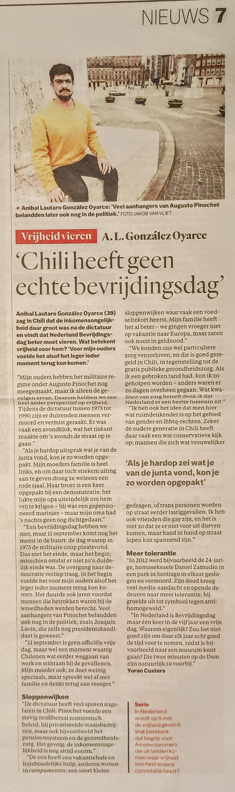
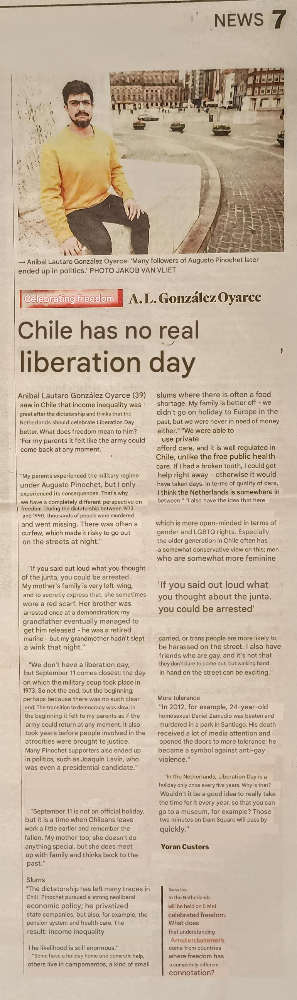
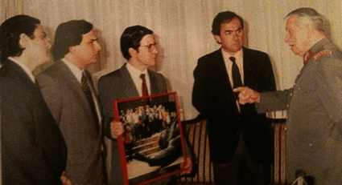

# The meaning of freedom - Chilean abroad perspective

On the 2025-05-01 my interview with Yoran Custers was published at Het Parool, and I would like to add a bit of more context since some portions were lost to the dreaded ***word limit***. 

The word on the street (the couple of friends that read the article) seems to have liked the mix between personal stories and systematic issues with liberty.
My only change to the article as it is, would have been the title from 'Chile has no real liberation day' to something along the lines 'Freedom in Chile, the neoliberal reality'.

## Table of Contents

1. [The original article](#the-original-article)
2. [The comments](#the-comments)
    1. [The background to Chile today](#the-background-to-chile-today)
    2. [A 90's kid perspective & the neoliberal model](#a-90s-kid-perspective--the-neoliberal-model)
    3. [Post-Dictatorship Governments: Unfulfilled Promises](#post-dictatorship-governments-unfulfilled-promises)
    4. [Liberation Day and the Question of Accountability](#liberation-day-and-the-question-of-accountability)
3. [References](#references)

## The original article

The original article and its translation to english are listed below. 

<table>
<tr>
<td style="width: 50%;"></td>
<td style="width: 50%;"></td>
</tr>
<tr>
<td align="center"><em>Original Document</em></td>
<td align="center"><em>English Translation</em></td>
</tr>
</table>

## The comments

### The background to Chile today

My perspective on freedom in Chile today is deeply shaped by the long-lasting consequences of U.S. foreign policy during the Cold War. Like many other nations, Chile became a pawn in the geopolitical struggle between the United States and the Soviet Union. This culminated in the U.S.-backed coup of 1973, which led to the rise of Augusto Pinochet and his military junta. Under Pinochet, a radical neoliberal economic model was imposed: state-owned companies were dismantled, natural resources were sold off, and public services were defunded.

### A 90's kid perspective & the neoliberal model.

Fast forward, Chile came back to a fragile democracy in 1990, which solidified over the years under the shadow of the constitution and economic policies set in the 70s. This has resulted in a country with high inequality (gini coefficient ~43%[^1]) where freedom is determined by people's purchasing power. Access to healthcare, education, and retirement are all determined by your income/wealth. Hence, to realise yourself as a person, for example, finding a job that not only provides but also makes you grow as a professional and individual is modulated by the thought of: 'but will the salary be enough?'.

In healthcare, those who can afford private services receive prompt, high-quality care—even in life-threatening situations—while others must endure long waits in an underfunded public system. The disparities in both access and quality are stark.

### Post-Dictatorship Governments: Unfulfilled Promises

Ironically, the very economic structures put in place by the dictatorship allowed Chile to achieve a degree of stability and growth. Some may see *Chile as a great country - comparatively rich (middle income), stable and safe today*. Yet this economic success has come at a price. Chile now faces a daunting challenge: to build a system that not only generates wealth but also distributes it fairly and enhances the quality of life for all citizens.

As the saying goes, "there's nothing more cowardly than a million dollars." Efforts to implement meaningful social and economic reforms often encounter resistance from capital flight and powerful economic interests wary of change.

### Liberation Day and the Question of Accountability

This section I believe is what was least developed in the original document. What I'm truly curious is what happened to the institutions and people that worked in them during the ocupation and that *just did their jobs* while the Nazi regime was in charge. At this moment in time, I don't know, though I thought it was a good idea to put this question out there. Was there some witch-hunt against poeple doing desk job? Or did they just melt into society as if nothing happened?.

This question resonates in Chile's own history. Many officials who supported or participated in Pinochet’s regime—including those complicit in human rights abuses—went on to enjoy prominent political careers. Figures such as Pablo Longueira, Andrés Chadwick and Joaquín Lavín remained influential long after the dictatorship ended. The following picture illustrates this point. 

 From left to right: Pablo Longeira, Andres Chadwick, Joaquin Lavin and Julio Dittborn. Staunch supporters of Pinochet, that went into politics on the right side of the spectrum.

Most notably, Christian Labbé, who has been linked to acts of torture and other atrocities, served as Mayor of Providencia—a conservative stronghold—from 1996 to 2012[^2].

## References

[^1]: World Bank, GINI index for Chile (latest available): [https://data.worldbank.org/indicator/SI.POV.GINI?locations=CL](https://data.worldbank.org/indicator/SI.POV.GINI?locations=CL)

[^2]: Wikipedia, Cristián Labbé Galilea: [https://es.wikipedia.org/wiki/Cristi%C3%A1n_Labb%C3%A9_Galilea](https://es.wikipedia.org/wiki/Cristi%C3%A1n_Labb%C3%A9_Galilea)